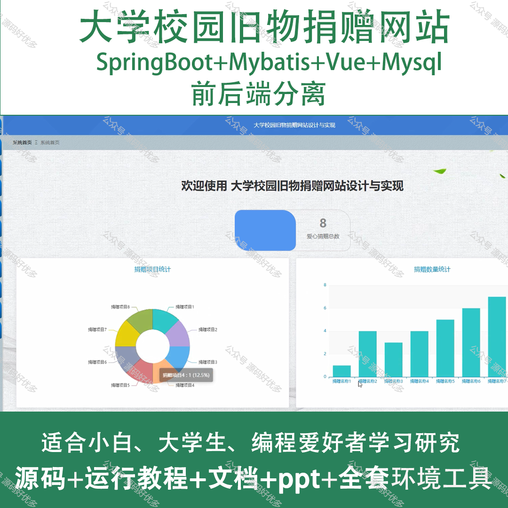
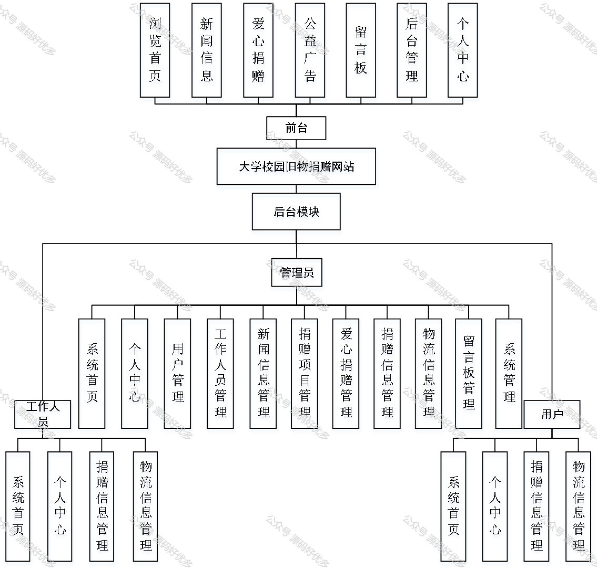
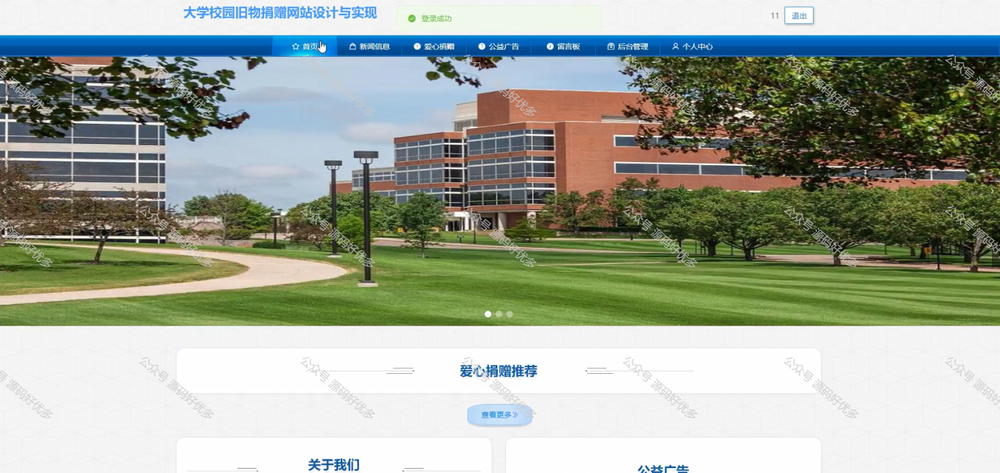
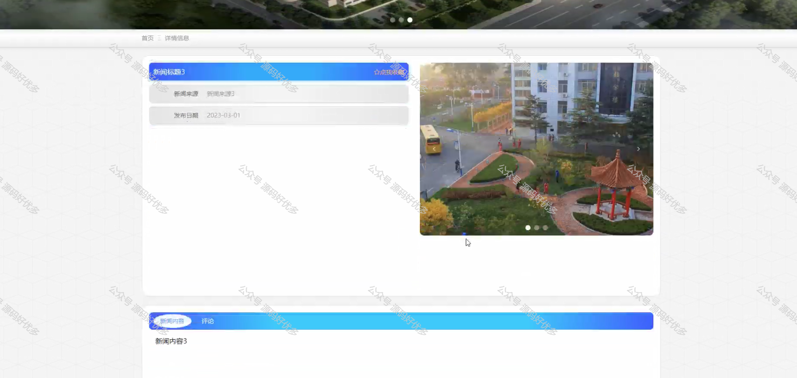
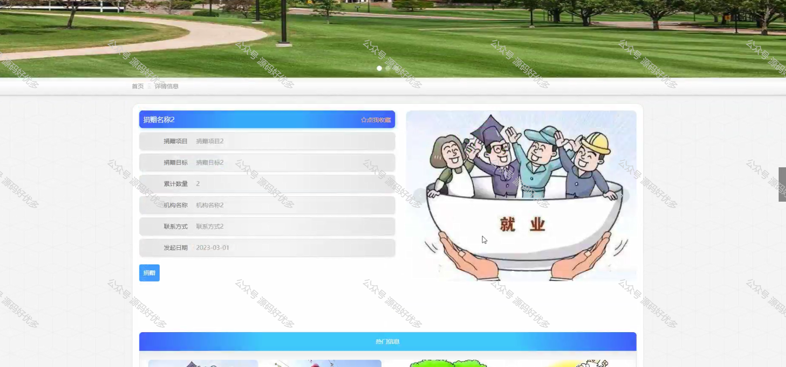
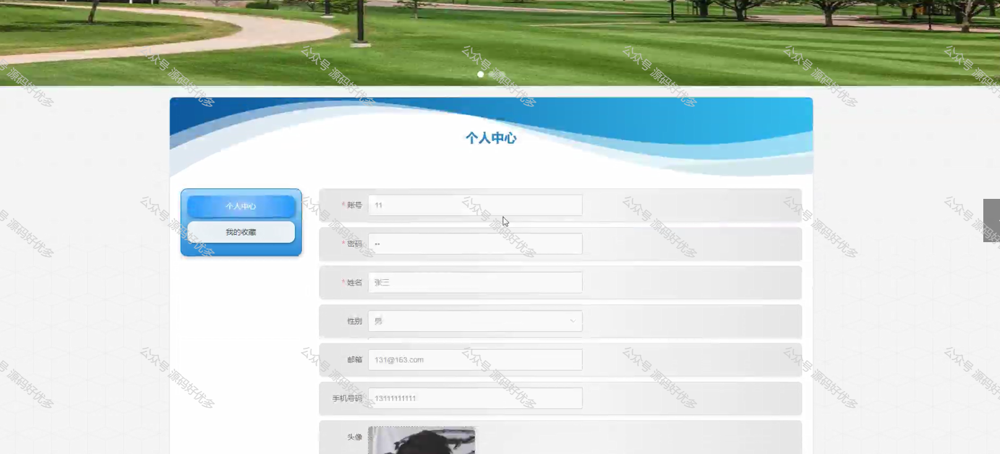
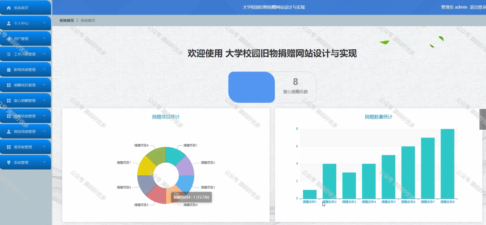
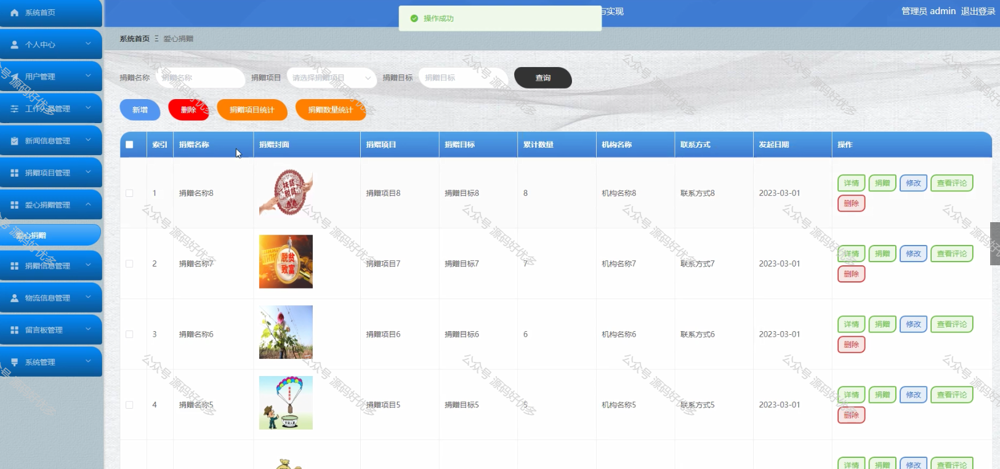
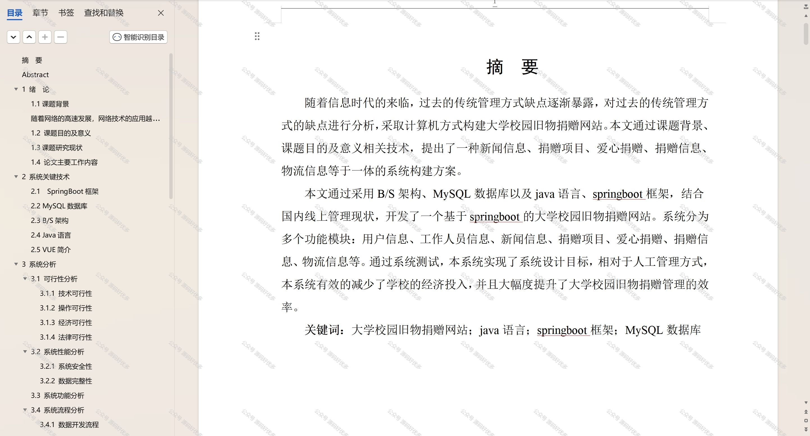

 
## 查看主页获取源码

> **作者介绍**： **✌**全网粉丝10W+本平台特邀作者、博客专家、CSDN新星计划导师、java领域优质创作者,博客之星、掘金/华为云/阿里云/InfoQ等平台优质作者、专注于项目实战 **✌**

  

### 一、作品包含

源码+数据库+设计文档万字+PPT+全套环境和工具资源+部署教程

### 二、项目技术

前端技术：Html、Css、Js、Vue、Element-ui

数据库：MySQL

后端技术：Java、Spring Boot、MyBatis

  

### 三、运行环境

开发工具：IDEA/eclipse

数据库：MySQL5.7

数据库管理工具：Navicat10以上版本

环境配置软件： JDK1.8+Maven3.6.3

前端Nodejs：14

### 四、项目介绍
项目编号：springbootA142

大学校园旧物捐赠网站是一个面向高校学生的公益平台，旨在倡导绿色环保的生活理念，提高资源的循环利用率。在这个平台上，毕业生可以将不再使用的书籍、衣物、生活用品等捐赠给有需要的学生，既减少了浪费，又帮助了他人，同时也增强了校园内的爱心传递和互助精神，为构建和谐、节约型校园文化贡献力量。

前台用户功能：浏览首页、新闻信息、爱心捐赠、公益广告、留言板、后台管理和个人中心。

后台分为管理员、用户、工作人员
管理员的功能：首页、个人中心、用户管理、工作人员管理、新闻信息管理、捐赠项目管理、爱心捐赠管理、捐赠信息管理、物流信息管理、留言板管理和系统管理。
用户的功能：系统首页、个人中心、捐赠信息管理、物流信息管理。
用工作人员的功能：系统首页、个人中心、捐赠信息管理、物流信息管理。

### 五、运行截图

  
